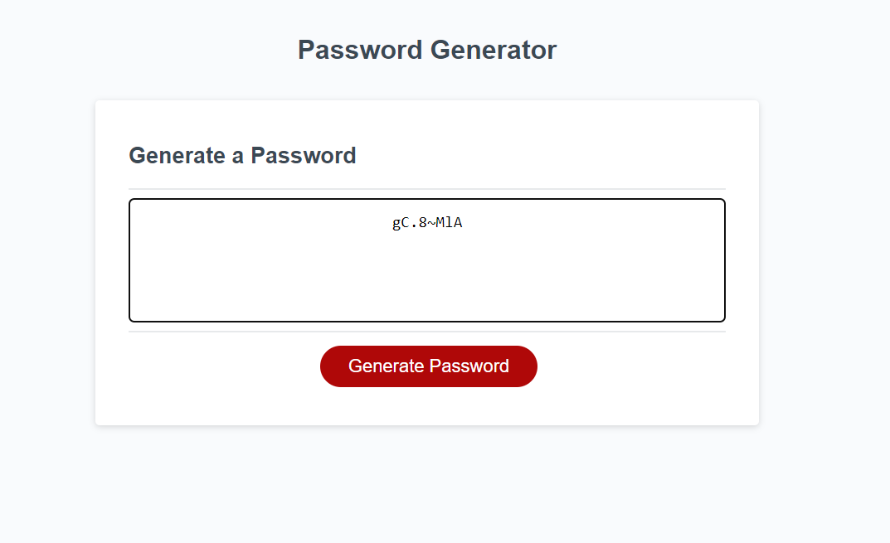

# Password generator

## Table of content:

1. [Description](#description)
2. [Visuals](#visuals)
3. A [link](https://anastasiia-ciloci.github.io/Password_generator/) to the passsword generator.

# Description

This is an application that enables to generate random passwords based on criteria user has been selected.
There are 4 options to shoose from: using lowercase letters, uppercase letters, numbers and special characters. A length of password is in range from 8 to 128 characters.

- To checking the number is in the range I used an _if statment_

```
if (count < 8 || count > 128 || !count) {
    alert(
      "The number you enter needs to be in the range of 8 and 128. Try again, please!"
    );
    return;
  }

```

- Practiced DOM manipulation to access the button "generate password"

```
 var generateBtn = document.querySelector("#generate");


```

- Also I used an event listener to make the button click generate the password

```
generateBtn.addEventListener("click", writePassword);

```

# Visuals

Here is the look of the application


Here is the look of generated password shown in the window.


# A link to the [Password Generator](https://anastasiia-ciloci.github.io/Password_generator/)

Or click [here](https://anastasiia-ciloci.github.io/Password_generator/) to open the password generator page.
